# Complete Wiring Diagrams & Maintenance Procedures

## Part 1: Wiring Diagrams Using WireViz

**WireViz** is the best tool for creating professional wiring diagrams. It generates PNG/SVG from YAML.

### Installation

```bash
# Install WireViz
pip3 install wireviz

# Generate diagram
wireviz sensor-hub.yml
# Creates: sensor-hub.png, sensor-hub.svg, sensor-hub.html
```

---

### 1.1 ESP32 Sensor Hub Wiring (WireViz)

**File: `sensor-hub-wiring.yml`**

```yaml
templates:
  - &wire_red
    color: RD
    gauge: 22 AWG
  - &wire_black
    color: BK
    gauge: 22 AWG
  - &wire_yellow
    color: YE
    gauge: 22 AWG
  - &wire_white
    color: WH
    gauge: 22 AWG
  - &wire_green
    color: GN
    gauge: 22 AWG

connectors:
  ESP32:
    type: ESP32 DevKit v1
    subtype: female
    pincount: 30
    notes: Main microcontroller for sensor hub
    pinlabels: [3V3, EN, GPIO36, GPIO39, GPIO34, GPIO35, GPIO32, GPIO33, GPIO25, GPIO26, GPIO27, GPIO14, GPIO12, GND, GPIO13, GPIO9, GPIO10, GPIO11, VIN, GPIO6, GPIO7, GPIO8, GPIO15, GPIO2, GPIO0, GPIO4, GPIO16, GPIO17, GPIO5, GPIO18, GPIO19, GND, GPIO21, GPIO22, GPIO23]
    
  Sensor_Z1:
    type: Capacitive Soil Moisture Sensor v1.2
    subtype: male
    pincount: 3
    notes: Zone 1 - Vegetables
    pinlabels: [VCC, AOUT, GND]
    
  Sensor_Z2:
    type: Capacitive Soil Moisture Sensor v1.2
    subtype: male
    pincount: 3
    notes: Zone 2 - Flowers
    pinlabels: [VCC, AOUT, GND]
    
  Sensor_Z3:
    type: Capacitive Soil Moisture Sensor v1.2
    subtype: male
    pincount: 3
    notes: Zone 3 - Lawn
    pinlabels: [VCC, AOUT, GND]
    
  BME280:
    type: BME280 I2C Module
    subtype: male
    pincount: 4
    notes: Temperature/Humidity/Pressure sensor (optional)
    pinlabels: [VCC, GND, SCL, SDA]
    
  Power_Supply:
    type: USB Power Supply
    subtype: male
    pincount: 2
    notes: 5V 2A Micro-USB
    pinlabels: [+5V, GND]

cables:
  W1:
    <<: *wire_red
    length: 0.5
    notes: 3.3V power rail
  W2:
    <<: *wire_black
    length: 0.5
    notes: Ground rail
  W3:
    <<: *wire_yellow
    length: 2
    notes: Zone 1 analog signal
  W4:
    <<: *wire_yellow
    length: 2
    notes: Zone 2 analog signal
  W5:
    <<: *wire_yellow
    length: 2
    notes: Zone 3 analog signal
  W6:
    <<: *wire_green
    length: 0.3
    notes: I2C SDA
  W7:
    <<: *wire_white
    length: 0.3
    notes: I2C SCL

connections:
  -
    - Power_Supply: [+5V]
    - W1: [1]
    - ESP32: [VIN]
  -
    - Power_Supply: [GND]
    - W2: [1]
    - ESP32: [GND]
  -
    - ESP32: [3V3]
    - W1: [2]
    - Sensor_Z1: [VCC]
  -
    - ESP32: [3V3]
    - W1: [3]
    - Sensor_Z2: [VCC]
  -
    - ESP32: [3V3]
    - W1: [4]
    - Sensor_Z3: [VCC]
  -
    - ESP32: [GPIO36]
    - W3: [1]
    - Sensor_Z1: [AOUT]
  -
    - ESP32: [GPIO39]
    - W4: [1]
    - Sensor_Z2: [AOUT]
  -
    - ESP32: [GPIO34]
    - W5: [1]
    - Sensor_Z3: [AOUT]
  -
    - ESP32: [GND]
    - W2: [2]
    - Sensor_Z1: [GND]
  -
    - ESP32: [GND]
    - W2: [3]
    - Sensor_Z2: [GND]
  -
    - ESP32: [GND]
    - W2: [4]
    - Sensor_Z3: [GND]
  -
    - ESP32: [3V3]
    - W1: [5]
    - BME280: [VCC]
  -
    - ESP32: [GND]
    - W2: [5]
    - BME280: [GND]
  -
    - ESP32: [GPIO21]
    - W6: [1]
    - BME280: [SDA]
  -
    - ESP32: [GPIO22]
    - W7: [1]
    - BME280: [SCL]

metadata:
  title: ESP32 Sensor Hub Wiring
  description: 3-zone soil moisture monitoring with environmental sensor
  notes: Use 3.3V for all sensors. Keep analog wires under 2m length.
```

---

### 1.2 ESP8266 Valve Controller Wiring (WireViz)

**File: `valve-controller-wiring.yml`**

```yaml
templates:
  - &wire_red
    color: RD
    gauge: 22 AWG
  - &wire_black
    color: BK
    gauge: 22 AWG
  - &wire_orange
    color: OG
    gauge: 22 AWG
  - &wire_blue
    color: BU
    gauge: 18 AWG
  - &wire_brown
    color: BN
    gauge: 18 AWG

connectors:
  ESP8266:
    type: Wemos D1 Mini
    subtype: female
    pincount: 16
    notes: Microcontroller for valve control
    pinlabels: [RST, A0, D0, D1, D2, D3, D4, D5, D6, D7, D8, TX, RX, 5V, GND, 3V3]
    
  Relay_Module:
    type: 5V 1-Channel Relay Module
    subtype: male
    pincount: 3
    notes: Opto-isolated relay (10A)
    pinlabels: [VCC, IN, GND]
    
  Relay_Contacts:
    type: Relay NO/COM Terminals
    subtype: screw terminal
    pincount: 3
    notes: Normally Open configuration
    pinlabels: [NO, COM, NC]
    
  Solenoid_Valve:
    type: 12V DC Solenoid Valve
    subtype: screw terminal
    pincount: 2
    notes: 1/2" NPT, normally closed
    pinlabels: [+12V, GND]
    
  Status_LED:
    type: 5mm LED (Red)
    subtype: male
    pincount: 2
    notes: Current limiting resistor included
    pinlabels: [Anode, Cathode]
    
  Resistor:
    type: Resistor 220Ω
    subtype: axial
    pincount: 2
    notes: LED current limiter
    pinlabels: [1, 2]
    
  Power_5V:
    type: USB Power Supply
    subtype: male
    pincount: 2
    notes: 5V 1A Micro-USB for ESP8266
    pinlabels: [+5V, GND]
    
  Power_12V:
    type: 12V DC Power Supply
    subtype: screw terminal
    pincount: 2
    notes: 12V 2A for solenoid valve
    pinlabels: [+12V, GND]

cables:
  W1:
    <<: *wire_red
    length: 0.2
    notes: 5V to relay
  W2:
    <<: *wire_black
    length: 0.2
    notes: Ground rail
  W3:
    <<: *wire_orange
    length: 0.15
    notes: GPIO control signal
  W4:
    <<: *wire_blue
    length: 0.5
    notes: 12V switched power
  W5:
    <<: *wire_brown
    length: 0.5
    notes: 12V ground return
  W6:
    <<: *wire_red
    length: 0.1
    notes: LED anode
  W7:
    <<: *wire_black
    length: 0.1
    notes: LED cathode

connections:
  -
    - Power_5V: [+5V]
    - ESP8266: [5V]
  -
    - Power_5V: [GND]
    - W2: [1]
    - ESP8266: [GND]
  -
    - ESP8266: [5V]
    - W1: [1]
    - Relay_Module: [VCC]
  -
    - ESP8266: [D1]
    - W3: [1]
    - Relay_Module: [IN]
  -
    - ESP8266: [GND]
    - W2: [2]
    - Relay_Module: [GND]
  -
    - Power_12V: [+12V]
    - W4: [1]
    - Relay_Contacts: [COM]
  -
    - Relay_Contacts: [NO]
    - W4: [2]
    - Solenoid_Valve: [+12V]
  -
    - Solenoid_Valve: [GND]
    - W5: [1]
    - Power_12V: [GND]
  -
    - ESP8266: [D2]
    - W6: [1]
    - Status_LED: [Anode]
  -
    - Status_LED: [Cathode]
    - Resistor: [1]
  -
    - Resistor: [2]
    - W7: [1]
    - ESP8266: [GND]

metadata:
  title: ESP8266 Valve Controller Wiring
  description: Single-zone irrigation valve control with status LED
  notes: |
    Safety features:
    - Opto-isolated relay prevents feedback
    - Separate power supplies for logic and valve
    - Flyback diode in relay module protects against inductive kickback
    - Common ground between ESP8266 and relay module required
```

---

## Part 2: Mermaid Logical Diagrams

While WireViz is better for physical wiring, Mermaid excels at logical flow:

### 2.1 System Architecture Diagram

```mermaid
graph TB
    subgraph Physical["Physical Layer"]
        S1[🌱 Soil Sensor Z1<br/>GPIO36]
        S2[🌱 Soil Sensor Z2<br/>GPIO39]
        S3[🌱 Soil Sensor Z3<br/>GPIO34]
        BME[🌡️ BME280<br/>I2C]
        
        V1[💧 Valve Z1<br/>GPIO5]
        V2[💧 Valve Z2<br/>GPIO5]
        V3[💧 Valve Z3<br/>GPIO5]
    end
    
    subgraph Controllers["Controller Layer"]
        ESP32[ESP32 DevKit v1<br/>192.168.1.100<br/>Sensor Hub]
        D1M1[ESP8266 D1 Mini<br/>192.168.1.111<br/>Valve Controller Z1]
        D1M2[ESP8266 D1 Mini<br/>192.168.1.112<br/>Valve Controller Z2]
        D1M3[ESP8266 D1 Mini<br/>192.168.1.113<br/>Valve Controller Z3]
    end
    
    subgraph Network["Network Layer"]
        MQTT[🔌 MQTT Broker<br/>Mosquitto<br/>Port 1883]
        WiFi[📡 WiFi Router<br/>192.168.1.1]
    end
    
    subgraph Processing["Processing Layer"]
        NR[⚙️ Node-RED<br/>Port 1880<br/>Decision Engine]
        Weather[🌦️ Weather API<br/>OpenWeatherMap]
    end
    
    subgraph Storage["Storage Layer"]
        IDB[(📊 InfluxDB<br/>Port 8086<br/>Time-Series DB)]
        GRF[📈 Grafana<br/>Port 3000<br/>Visualization]
    end
    
    S1 & S2 & S3 & BME --> ESP32
    V1 --> D1M1
    V2 --> D1M2
    V3 --> D1M3
    
    ESP32 & D1M1 & D1M2 & D1M3 --> WiFi
    WiFi --> MQTT
    
    MQTT --> NR
    Weather --> NR
    
    NR --> IDB
    NR --> MQTT
    
    IDB --> GRF
    
    style ESP32 fill:#4CAF50,color:#fff
    style D1M1 fill:#2196F3,color:#fff
    style D1M2 fill:#2196F3,color:#fff
    style D1M3 fill:#2196F3,color:#fff
    style MQTT fill:#FF9800,color:#fff
    style NR fill:#E91E63,color:#fff
    style IDB fill:#9C27B0,color:#fff
    style GRF fill:#F44336,color:#fff
```



---

### 2.2 Data Flow Diagram


---

### 2.3 Power Distribution Diagram

```mermaid
graph LR
    subgraph AC["AC Power 110/220V"]
        Wall[🔌 Wall Outlet]
    end
    
    subgraph DC5V["5V DC Power"]
        PSU5V1[USB PSU 5V/2A]
        PSU5V2[USB PSU 5V/1A]
        PSU5V3[USB PSU 5V/1A]
        PSU5V4[USB PSU 5V/1A]
    end
    
    subgraph DC12V["12V DC Power"]
        PSU12V[12V/2A PSU]
    end
    
    subgraph Devices["Powered Devices"]
        ESP32[ESP32<br/>~200mA]
        D1M1[D1 Mini Z1<br/>~80mA]
        D1M2[D1 Mini Z2<br/>~80mA]
        D1M3[D1 Mini Z3<br/>~80mA]
        
        Relay1[Relay Z1<br/>~70mA]
        Relay2[Relay Z2<br/>~70mA]
        Relay3[Relay Z3<br/>~70mA]
        
        Valve1[Valve Z1<br/>~500mA]
        Valve2[Valve Z2<br/>~500mA]
        Valve3[Valve Z3<br/>~500mA]
        
        Sensors[3x Sensors<br/>~15mA each]
        BME[BME280<br/>~3mA]
    end
    
    Wall --> PSU5V1
    Wall --> PSU5V2
    Wall --> PSU5V3
    Wall --> PSU5V4
    Wall --> PSU12V
    
    PSU5V1 -->|USB Cable| ESP32
    PSU5V2 -->|USB Cable| D1M1
    PSU5V3 -->|USB Cable| D1M2
    PSU5V4 -->|USB Cable| D1M3
    
    ESP32 -->|3.3V reg| Sensors
    ESP32 -->|3.3V reg| BME
    
    D1M1 -->|5V| Relay1
    D1M2 -->|5V| Relay2
    D1M3 -->|5V| Relay3
    
    PSU12V --> Relay1
    PSU12V --> Relay2
    PSU12V --> Relay3
    
    Relay1 -->|Switched| Valve1
    Relay2 -->|Switched| Valve2
    Relay3 -->|Switched| Valve3
    
    style Wall fill:#f9f,stroke:#333,stroke-width:4px
    style PSU5V1 fill:#bbf,stroke:#333
    style PSU5V2 fill:#bbf,stroke:#333
    style PSU5V3 fill:#bbf,stroke:#333
    style PSU5V4 fill:#bbf,stroke:#333
    style PSU12V fill:#fbb,stroke:#333
    style ESP32 fill:#4CAF50,color:#fff
    style D1M1 fill:#2196F3,color:#fff
    style D1M2 fill:#2196F3,color:#fff
    style D1M3 fill:#2196F3,color:#fff
```



---

### 2.4 Pin Assignment Diagram

```mermaid
graph TD
    subgraph ESP32["ESP32 DevKit v1 Pin Assignments"]
        direction TB
        P36[GPIO36 VP<br/>📊 Zone 1 Moisture]
        P39[GPIO39 VN<br/>📊 Zone 2 Moisture]
        P34[GPIO34<br/>📊 Zone 3 Moisture]
        P21[GPIO21<br/>🔗 I2C SDA]
        P22[GPIO22<br/>🔗 I2C SCL]
        P2[GPIO2<br/>💡 Status LED]
        GND1[GND<br/>⏚ Common Ground]
        V33[3V3<br/>⚡ Sensor Power]
        VIN[VIN<br/>⚡ 5V Input]
    end
    
    subgraph D1Mini["D1 Mini Pin Assignments"]
        direction TB
        D1[D1 GPIO5<br/>🔌 Relay Control]
        D2[D2 GPIO4<br/>💡 Status LED]
        D5V[5V<br/>⚡ Power In]
        DGND[GND<br/>⏚ Ground]
    end
    
    style P36 fill:#FFB74D,color:#000
    style P39 fill:#FFB74D,color:#000
    style P34 fill:#FFB74D,color:#000
    style P21 fill:#81C784,color:#000
    style P22 fill:#81C784,color:#000
    style P2 fill:#64B5F6,color:#000
    style D1 fill:#E57373,color:#000
    style D2 fill:#64B5F6,color:#000
```



---

## Part 3: Color-Coded Connection Tables

### 3.1 ESP32 Sensor Hub Connections

| Component | Pin | Wire Color | ESP32 Pin | Function | Notes |
|-----------|-----|------------|-----------|----------|-------|
| **Soil Sensor Zone 1** | | | | | |
| VCC | Red 🔴 | 22 AWG | 3V3 | Power | **Use 3.3V NOT 5V** |
| AOUT | Yellow 🟡 | 22 AWG | GPIO36 (VP) | Analog signal | ADC1_CH0, keep wire < 2m |
| GND | Black ⚫ | 22 AWG | GND | Ground | Common ground |
| **Soil Sensor Zone 2** | | | | | |
| VCC | Red 🔴 | 22 AWG | 3V3 | Power | Share 3V3 rail |
| AOUT | Orange 🟠 | 22 AWG | GPIO39 (VN) | Analog signal | ADC1_CH3 |
| GND | Black ⚫ | 22 AWG | GND | Ground | |
| **Soil Sensor Zone 3** | | | | | |
| VCC | Red 🔴 | 22 AWG | 3V3 | Power | |
| AOUT | Green 🟢 | 22 AWG | GPIO34 | Analog signal | ADC1_CH6 |
| GND | Black ⚫ | 22 AWG | GND | Ground | |
| **BME280 (Optional)** | | | | | |
| VCC | Red 🔴 | 22 AWG | 3V3 | Power | I2C address 0x76 |
| GND | Black ⚫ | 22 AWG | GND | Ground | |
| SCL | White ⚪ | 22 AWG | GPIO22 | I2C Clock | Pull-up on module |
| SDA | Blue 🔵 | 22 AWG | GPIO21 | I2C Data | Pull-up on module |
| **Power Supply** | | | | | |
| +5V | Red 🔴 | USB | VIN | Power input | Micro-USB 5V 2A |
| GND | Black ⚫ | USB | GND | Ground | |

---

### 3.2 ESP8266 Valve Controller Connections

| Component | Pin | Wire Color | D1 Mini Pin | Function | Notes |
|-----------|-----|------------|-------------|----------|-------|
| **5V Relay Module** | | | | | |
| VCC | Red 🔴 | 22 AWG | 5V | Power | Shared from USB |
| IN (Signal) | Orange 🟠 | 22 AWG | D1 (GPIO5) | Control signal | Active LOW trigger |
| GND | Black ⚫ | 22 AWG | GND | Ground | **Common ground required** |
| **Status LED** | | | | | |
| Anode (+) | Red 🔴 | 22 AWG | D2 (GPIO4) | Control | Via 220Ω resistor |
| Cathode (-) | Black ⚫ | 22 AWG | GND | Ground | |
| **12V Power Supply** | | | | | |
| +12V | Brown 🟤 | 18 AWG | Relay COM | Valve power | Separate PSU 12V 2A |
| GND | Blue 🔵 | 18 AWG | Valve (-) | Ground return | **Isolated from 5V ground** |
| **Relay Contacts** | | | | | |
| COM | Brown 🟤 | 18 AWG | 12V PSU (+) | Common | From PSU |
| NO | Brown 🟤 | 18 AWG | Valve (+) | Normally Open | To solenoid |
| NC | - | - | Not connected | Normally Closed | Not used |
| **ESP8266 Power** | | | | | |
| +5V | Red 🔴 | USB | 5V | Power input | Micro-USB 5V 1A |
| GND | Black ⚫ | USB | GND | Ground | |

**⚠️ Critical Safety Notes:**
- Keep 5V logic ground and 12V valve ground **separate** (only connected at relay)
- Use opto-isolated relay module to prevent backfeed
- 18 AWG wire minimum for valve current (500mA+)
- Add flyback diode if relay module doesn't include one

---

## Part 4: OTA Update Procedures

### 4.1 ESPHome OTA Updates

#### Method 1: Command Line (Recommended)

**File: `ota-update-all.sh`**

```bash
#!/bin/bash

##############################################################################
# ESPHome OTA Mass Update Script
# Updates all devices via WiFi
##############################################################################

# Configuration
ESPHOME_CONFIGS=(
    "sensor-hub-esp32.yaml"
    "valve-zone1-esp8266.yaml"
    "valve-zone2-esp8266.yaml"
    "valve-zone3-esp8266.yaml"
)

DEVICE_IPS=(
    "192.168.1.100"
    "192.168.1.111"
    "192.168.1.112"
    "192.168.1.113"
)

DEVICE_NAMES=(
    "Sensor Hub (ESP32)"
    "Valve Zone 1"
    "Valve Zone 2"
    "Valve Zone 3"
)

# Colors for output
RED='\033[0;31m'
GREEN='\033[0;32m'
YELLOW='\033[1;33m'
NC='\033[0m' # No Color

##############################################################################
# Functions
##############################################################################

log_info() {
    echo -e "${GREEN}[INFO]${NC} $1"
}

log_warn() {
    echo -e "${YELLOW}[WARN]${NC} $1"
}

log_error() {
    echo -e "${RED}[ERROR]${NC} $1"
}

check_device_online() {
    local ip=$1
    ping -c 1 -W 2 "$ip" > /dev/null 2>&1
    return $?
}

backup_config() {
    local config=$1
    local backup_dir="backups/$(date +%Y%m%d_%H%M%S)"
    mkdir -p "$backup_dir"
    cp "$config" "$backup_dir/"
    log_info "Backed up $config to $backup_dir"
}

compile_firmware() {
    local config=$1
    log_info "Compiling $config..."
    esphome compile "$config" 2>&1 | tee "logs/compile_$(basename $config .yaml).log"
    return ${PIPESTATUS[0]}
}

upload_ota() {
    local config=$1
    local ip=$2
    log_info "Uploading to $ip via OTA..."
    esphome upload "$config" --device "$ip" 2>&1 | tee "logs/upload_$(basename $config .yaml).log"
    return ${PIPESTATUS[0]}
}

##############################################################################
# Main Script
##############################################################################

# Create log directory
mkdir -p logs backups

log_info "Starting ESPHome OTA Update Process"
echo "======================================"
echo ""

# Summary
log_info "Devices to update: ${#ESPHOME_CONFIGS[@]}"
for i in "${!DEVICE_NAMES[@]}"; do
    echo "  [$((i+1))] ${DEVICE_NAMES[$i]} - ${DEVICE_IPS[$i]}"
done
echo ""

# Confirmation
read -p "Continue with OTA updates? (y/N): " confirm
if [[ ! "$confirm" =~ ^[Yy]$ ]]; then
    log_warn "Update cancelled by user"
    exit 0
fi

# Update each device
success_count=0
fail_count=0

for i in "${!ESPHOME_CONFIGS[@]}"; do
    config="${ESPHOME_CONFIGS[$i]}"
    ip="${DEVICE_IPS[$i]}"
    name="${DEVICE_NAMES[$i]}"
    
    echo ""
    echo "======================================"
    log_info "Processing [$((i+1))/${#ESPHOME_CONFIGS[@]}]: $name"
    echo "======================================"
    
    # Check if device is online
    log_info "Checking if $ip is reachable..."
    if ! check_device_online "$ip"; then
        log_error "$name is OFFLINE at $ip"
        ((fail_count++))
        continue
    fi
    log_info "$name is online ✓"
    
    # Backup current config
    backup_config "$config"
    
    # Compile firmware
    if ! compile_firmware "$config"; then
        log_error "Compilation failed for $config"
        ((fail_count++))
        continue
    fi
    log_info "Compilation successful ✓"
    
    # Upload via OTA
    if ! upload_ota "$config" "$ip"; then
        log_error "OTA upload failed for $name"
        ((fail_count++))
        continue
    fi
    log_info "Upload successful ✓"
    
    # Wait for device to reboot
    log_info "Waiting 30 seconds for device to reboot..."
    sleep 30
    
    # Verify device came back online
    if check_device_online "$ip"; then
        log_info "$name rebooted successfully ✓"
        ((success_count++))
    else
        log_warn "$name did not come back online (may need more time)"
        ((fail_count++))
    fi
done

# Summary
echo ""
echo "======================================"
log_info "OTA Update Summary"
echo "======================================"
echo "Successful: $success_count"
echo "Failed:     $fail_count"
echo "Total:      ${#ESPHOME_CONFIGS[@]}"
echo ""

if [ $fail_count -eq 0 ]; then
    log_info "All updates completed successfully!"
    exit 0
else
    log_warn "Some updates failed. Check logs in ./logs/"
    exit 1
fi
```

**Make executable:**
```bash
chmod +x ota-update-all.sh
./ota-update-all.sh
```

---

#### Method 2: Individual Device Update

**File: `ota-update-single.sh`**

```bash
#!/bin/bash

##############################################################################
# ESPHome Single Device OTA Update
# Usage: ./ota-update-single.sh <config.yaml> <device-ip>
##############################################################################

if [ $# -ne 2 ]; then
    echo "Usage: $0 <config.yaml> <device-ip>"
    echo "Example: $0 sensor-hub-esp32.yaml 192.168.1.100"
    exit 1
fi

CONFIG=$1
DEVICE_IP=$2

# Check if config exists
if [ ! -f "$CONFIG" ]; then
    echo "Error: Config file $CONFIG not found"
    exit 1
fi

# Create backup
BACKUP_DIR="backups/$(date +%Y%m%d_%H%M%S)"
mkdir -p "$BACKUP_DIR"
cp "$CONFIG" "$BACKUP_DIR/"
echo "Backed up to $BACKUP_DIR"

# Compile
echo "Compiling $CONFIG..."
if ! esphome compile "$CONFIG"; then
    echo "Compilation failed!"
    exit 1
fi

# Upload
echo "Uploading to $DEVICE_IP..."
if ! esphome upload "$CONFIG" --device "$DEVICE_IP"; then
    echo "Upload failed!"
    exit 1
fi

echo "Update successful!"
```

---

#### Method 3: Web Dashboard Upload

**For single updates via browser:**

```bash
# Start ESPHome dashboard
esphome dashboard .

# Open browser to: http://localhost:6052
# Click "Upload" next to device
# Select "Wirelessly"
# Enter device password if prompted
```

---

### 4.2 Fallback Recovery Procedure

**When OTA fails (device unreachable):**

**File: `usb-recovery.sh`**

```bash
#!/bin/bash

##############################################################################
# USB Recovery Flash - When OTA Fails
# Requires USB connection to device
##############################################################################

if [ $# -ne 2 ]; then
    echo "Usage: $0 <config.yaml> <usb-port>"
    echo "Example: $0 sensor-hub-esp32.yaml /dev/ttyUSB0"
    echo ""
    echo "Find USB port:"
    echo "  Linux: ls /dev/ttyUSB* /dev/ttyACM*"
    echo "  macOS: ls /dev/cu.*"
    exit 1
fi

CONFIG=$1
PORT=$2

echo "====================================="
echo "USB Recovery Flash"
echo "====================================="
echo "Config: $CONFIG"
echo "Port:   $PORT"
echo ""

# Check port exists
if [ ! -e "$PORT" ]; then
    echo "Error: Port $PORT not found"
    exit 1
fi

# Backup
BACKUP_DIR="backups/recovery_$(date +%Y%m%d_%H%M%S)"
mkdir -p "$BACKUP_DIR"
cp "$CONFIG" "$BACKUP_DIR/"
echo "Backup saved to $BACKUP_DIR"
echo ""

# Compile
echo "Compiling firmware..."
if ! esphome compile "$CONFIG"; then
    echo "Compilation failed!"
    exit 1
fi
echo ""

# Upload via USB
echo "Flashing via USB..."
echo "Make sure device is in bootloader mode:"
echo "  ESP32: Hold BOOT button, press EN, release BOOT"
echo "  ESP8266: Connect GPIO0 to GND during power-up"
echo ""
read -p "Device ready? Press Enter to continue..."

if ! esphome upload "$CONFIG" --device "$PORT"; then
    echo ""
    echo "Flash failed. Troubleshooting:"
    echo "1. Check USB cable (data cable, not charge-only)"
    echo "2. Install drivers: pip install esptool pyserial"
    echo "3. Check permissions: sudo usermod -a -G dialout \$USER"
    echo "4. Try different USB port"
    exit 1
fi

echo ""
echo "====================================="
echo "Flash successful!"
echo "====================================="
echo "Device should now:"
echo "1. Boot with new firmware"
echo "2. Connect to WiFi"
echo "3. Be available for OTA updates"
echo ""
echo "Check device logs:"
echo "  esphome logs $CONFIG --device $PORT"
```

---

### 4.3 Version Management

**File: `version-info.sh`**

```bash
#!/bin/bash

##############################################################################
# Check Current Firmware Versions
##############################################################################

DEVICES=(
    "192.168.1.100:garden-sensor-hub"
    "192.168.1.111:garden-valve-zone1"
    "192.168.1.112:garden-valve-zone2"
    "192.168.1.113:garden-valve-zone3"
)

echo "======================================"
echo "ESPHome Device Version Check"
echo "======================================"
echo ""

for device in "${DEVICES[@]}"; do
    IFS=':' read -r ip name <<< "$device"
    
    echo "Checking $name ($ip)..."
    
    # Ping test
    if ! ping -c 1 -W 2 "$ip" > /dev/null 2>&1; then
        echo "  ❌ OFFLINE"
        echo ""
        continue
    fi
    
    # Get version from web server
    version=$(curl -s "http://$ip/" | grep -oP 'ESPHome \K[0-9.]+' | head -1)
    
    if [ -n "$version" ]; then
        echo "  ✓ Online"
        echo "  Version: $version"
    else
        echo "  ⚠ Online but version unknown"
    fi
    
    echo ""
done

echo "======================================"
echo "Local ESPHome CLI Version:"
esphome version
echo "======================================"
```

---

## Part 5: Backup & Restore Scripts

### 5.1 Complete System Backup

**File: `backup-all.sh`**

```bash
#!/bin/bash

##############################################################################
# Complete Irrigation System Backup Script
# Backs up: Docker volumes, ESPHome configs, Node-RED flows, databases
##############################################################################

set -e  # Exit on error

# Configuration
BACKUP_ROOT="/home/$USER/garden-backups"
BACKUP_DIR="$BACKUP_ROOT/$(date +%Y%m%d_%H%M%S)"
DOCKER_COMPOSE_DIR="$HOME/garden-automation"

# Colors
GREEN='\033[0;32m'
BLUE='\033[0;34m'
YELLOW='\033[1;33m'
NC='\033[0m'

##############################################################################
# Functions
##############################################################################

log() {
    echo -e "${GREEN}[$(date +%H:%M:%S)]${NC} $1"
}

log_section() {
    echo ""
    echo -e "${BLUE}======================================${NC}"
    echo -e "${BLUE}$1${NC}"
    echo -e "${BLUE}======================================${NC}"
}

##############################################################################
# Main Backup Process
##############################################################################

log_section "Garden Irrigation System Backup"
log "Backup destination: $BACKUP_DIR"
echo ""

# Create backup directory
mkdir -p "$BACKUP_DIR"/{esphome,docker,nodered,influxdb,grafana,configs,logs}

##############################################################################
# 1. ESPHome Configurations
##############################################################################

log_section "Backing up ESPHome Configurations"

if [ -d "$HOME/esphome" ]; then
    log "Copying ESPHome configs..."
    cp -r "$HOME/esphome"/*.yaml "$BACKUP_DIR/esphome/" 2>/dev/null || true
    cp "$HOME/esphome/secrets.yaml" "$BACKUP_DIR/esphome/" 2>/dev/null || true
    
    # Count files
    count=$(ls -1 "$BACKUP_DIR/esphome"/*.yaml 2>/dev/null | wc -l)
    log "Backed up $count YAML files"
else
    log "ESPHome directory not found, skipping"
fi

##############################################################################
# 2. Docker Compose Configuration
##############################################################################

log_section "Backing up Docker Compose Files"

if [ -f "$DOCKER_COMPOSE_DIR/docker-compose.yml" ]; then
    log "Copying docker-compose.yml..."
    cp "$DOCKER_COMPOSE_DIR/docker-compose.yml" "$BACKUP_DIR/docker/"
    
    # Also backup .env if exists
    if [ -f "$DOCKER_COMPOSE_DIR/.env" ]; then
        cp "$DOCKER_COMPOSE_DIR/.env" "$BACKUP_DIR/docker/"
        log "Copied .env file"
    fi
else
    log "Docker compose file not found"
fi

##############################################################################
# 3. Node-RED Flows
##############################################################################

log_section "Backing up Node-RED Flows"

if [ -d "$DOCKER_COMPOSE_DIR/nodered/data" ]; then
    log "Exporting Node-RED flows..."
    
    # Copy flows and credentials
    cp "$DOCKER_COMPOSE_DIR/nodered/data"/flows*.json "$BACKUP_DIR/nodered/" 2>/dev/null || true
    cp "$DOCKER_COMPOSE_DIR/nodered/data"/flows*_cred.json "$BACKUP_DIR/nodered/" 2>/dev/null || true
    
    # Copy settings
    cp "$DOCKER_COMPOSE_DIR/nodered/data/settings.js" "$BACKUP_DIR/nodered/" 2>/dev/null || true
    
    # Copy installed nodes list
    if [ -f "$DOCKER_COMPOSE_DIR/nodered/data/package.json" ]; then
        cp "$DOCKER_COMPOSE_DIR/nodered/data/package.json" "$BACKUP_DIR/nodered/"
    fi
    
    count=$(ls -1 "$BACKUP_DIR/nodered"/*.json 2>/dev/null | wc -l)
    log "Backed up $count flow files"
else
    log "Node-RED data directory not found"
fi

##############################################################################
# 4. InfluxDB Database
##############################################################################

log_section "Backing up InfluxDB Database"

# Check if container is running
if docker ps | grep -q influxdb; then
    log "Exporting InfluxDB data..."
    
    # Export database
    docker exec influxdb influxd backup -portable /tmp/influxdb_backup 2>/dev/null || {
        log "Trying alternative backup method..."
        docker exec influxdb influx_inspect export \
            -datadir /var/lib/influxdb/data \
            -waldir /var/lib/influxdb/wal \
            -out /tmp/influxdb_export.txt 2>/dev/null || true
    }
    
    # Copy backup from container
    docker cp influxdb:/tmp/influxdb_backup "$BACKUP_DIR/influxdb/" 2>/dev/null || true
    docker cp influxdb:/tmp/influxdb_export.txt "$BACKUP_DIR/influxdb/" 2>/dev/null || true
    
    # Clean up container
    docker exec influxdb rm -rf /tmp/influxdb_backup /tmp/influxdb_export.txt 2>/dev/null || true
    
    # Get database size
    size=$(docker exec influxdb du -sh /var/lib/influxdb 2>/dev/null | cut -f1)
    log "Database size: $size"
else
    log "InfluxDB container not running"
fi

##############################################################################
# 5. Grafana Dashboards & Data Sources
##############################################################################

log_section "Backing up Grafana Configuration"

if docker ps | grep -q grafana; then
    log "Exporting Grafana data..."
    
    # Copy Grafana data directory
    docker cp grafana:/var/lib/grafana "$BACKUP_DIR/grafana/data" 2>/dev/null || true
    
    # Export dashboards via API
    GRAFANA_URL="http://localhost:3000"
    GRAFANA_USER="admin"
    GRAFANA_PASS=$(grep GF_SECURITY_ADMIN_PASSWORD "$DOCKER_COMPOSE_DIR/docker-compose.yml" | cut -d'=' -f2 | tr -d ' ')
    
    # Get all dashboards
    log "Exporting dashboards via API..."
    mkdir -p "$BACKUP_DIR/grafana/dashboards"
    
    # Get dashboard UIDs
    uids=$(curl -s -u "$GRAFANA_USER:$GRAFANA_PASS" "$GRAFANA_URL/api/search?type=dash-db" | \
           grep -o '"uid":"[^"]*"' | cut -d'"' -f4)
    
    for uid in $uids; do
        curl -s -u "$GRAFANA_USER:$GRAFANA_PASS" \
            "$GRAFANA_URL/api/dashboards/uid/$uid" | \
            jq '.dashboard' > "$BACKUP_DIR/grafana/dashboards/$uid.json" 2>/dev/null || true
    done
    
    count=$(ls -1 "$BACKUP_DIR/grafana/dashboards"/*.json 2>/dev/null | wc -l)
    log "Exported $count dashboards"
    
    # Export data sources
    curl -s -u "$GRAFANA_USER:$GRAFANA_PASS" \
        "$GRAFANA_URL/api/datasources" > "$BACKUP_DIR/grafana/datasources.json" 2>/dev/null || true
    log "Exported data sources"
else
    log "Grafana container not running"
fi

##############################################################################
# 6. Mosquitto MQTT Configuration
##############################################################################

log_section "Backing up Mosquitto Configuration"

if [ -d "$DOCKER_COMPOSE_DIR/mosquitto" ]; then
    log "Copying Mosquitto configs..."
    cp -r "$DOCKER_COMPOSE_DIR/mosquitto/config" "$BACKUP_DIR/configs/mosquitto/" 2>/dev/null || true
    
    # Don't backup data (retained messages) by default - too large
    # Uncomment if needed:
    # cp -r "$DOCKER_COMPOSE_DIR/mosquitto/data" "$BACKUP_DIR/configs/mosquitto/" 2>/dev/null || true
else
    log "Mosquitto directory not found"
fi

##############################################################################
# 7. Zigbee2MQTT Configuration
##############################################################################

log_section "Backing up Zigbee2MQTT Configuration"

if [ -d "$DOCKER_COMPOSE_DIR/zigbee2mqtt/data" ]; then
    log "Copying Zigbee2MQTT configs..."
    cp "$DOCKER_COMPOSE_DIR/zigbee2mqtt/data/configuration.yaml" "$BACKUP_DIR/configs/zigbee2mqtt/" 2>/dev/null || true
    cp "$DOCKER_COMPOSE_DIR/zigbee2mqtt/data/database.db" "$BACKUP_DIR/configs/zigbee2mqtt/" 2>/dev/null || true
    log "Backed up Zigbee2MQTT configuration and device database"
else
    log "Zigbee2MQTT directory not found"
fi

##############################################################################
# 8. System Information
##############################################################################

log_section "Collecting System Information"

{
    echo "Backup Date: $(date)"
    echo "Hostname: $(hostname)"
    echo "Docker Version: $(docker --version)"
    echo ""
    echo "=== Running Containers ==="
    docker ps --format "table {{.Names}}\t{{.Status}}\t{{.Image}}"
    echo ""
    echo "=== Docker Compose Services ==="
    cd "$DOCKER_COMPOSE_DIR" && docker-compose ps
    echo ""
    echo "=== ESPHome Devices ==="
    ls -1 "$HOME/esphome"/*.yaml 2>/dev/null || echo "None found"
} > "$BACKUP_DIR/system-info.txt"

log "System information saved"

##############################################################################
# 9. Create Compressed Archive
##############################################################################

log_section "Creating Compressed Archive"

cd "$BACKUP_ROOT"
ARCHIVE_NAME="garden-backup-$(date +%Y%m%d_%H%M%S).tar.gz"

log "Compressing backup..."
tar -czf "$ARCHIVE_NAME" "$(basename $BACKUP_DIR)"

# Get archive size
ARCHIVE_SIZE=$(du -h "$ARCHIVE_NAME" | cut -f1)
log "Archive created: $ARCHIVE_NAME ($ARCHIVE_SIZE)"

# Clean up uncompressed directory
rm -rf "$BACKUP_DIR"

##############################################################################
# 10. Backup Retention
##############################################################################

log_section "Managing Backup Retention"

# Keep last 7 daily backups
log "Applying retention policy (keep last 7 backups)..."
ls -t "$BACKUP_ROOT"/garden-backup-*.tar.gz | tail -n +8 | xargs -r rm
REMAINING=$(ls -1 "$BACKUP_ROOT"/garden-backup-*.tar.gz 2>/dev/null | wc -l)
log "Backups remaining: $REMAINING"

##############################################################################
# Summary
##############################################################################

log_section "Backup Complete"

echo ""
echo "Backup Details:"
echo "  Location: $BACKUP_ROOT/$ARCHIVE_NAME"
echo "  Size: $ARCHIVE_SIZE"
echo ""
echo "Contents:"
echo "  ✓ ESPHome configurations"
echo "  ✓ Docker Compose files"
echo "  ✓ Node-RED flows"
echo "  ✓ InfluxDB database"
echo "  ✓ Grafana dashboards"
echo "  ✓ MQTT configuration"
echo "  ✓ Zigbee2MQTT settings"
echo "  ✓ System information"
echo ""

log "Backup successful!"
```

**Make executable:**
```bash
chmod +x backup-all.sh
./backup-all.sh
```

---

### 5.2 Restore Script

**File: `restore-backup.sh`**

```bash
#!/bin/bash

##############################################################################
# Complete Irrigation System Restore Script
##############################################################################

set -e

if [ $# -ne 1 ]; then
    echo "Usage: $0 <backup-archive.tar.gz>"
    echo ""
    echo "Available backups:"
    ls -lh ~/garden-backups/garden-backup-*.tar.gz 2>/dev/null || echo "  None found"
    exit 1
fi

BACKUP_ARCHIVE=$1
RESTORE_DIR="/tmp/garden-restore-$$"
DOCKER_COMPOSE_DIR="$HOME/garden-automation"

# Colors
GREEN='\033[0;32m'
BLUE='\033[0;34m'
RED='\033[0;31m'
YELLOW='\033[1;33m'
NC='\033[0m'

log() {
    echo -e "${GREEN}[$(date +%H:%M:%S)]${NC} $1"
}

log_section() {
    echo ""
    echo -e "${BLUE}======================================${NC}"
    echo -e "${BLUE}$1${NC}"
    echo -e "${BLUE}======================================${NC}"
}

log_warn() {
    echo -e "${YELLOW}[WARN]${NC} $1"
}

log_error() {
    echo -e "${RED}[ERROR]${NC} $1"
}

##############################################################################
# Verification
##############################################################################

if [ ! -f "$BACKUP_ARCHIVE" ]; then
    log_error "Backup archive not found: $BACKUP_ARCHIVE"
    exit 1
fi

log_section "Garden Irrigation System Restore"
log "Archive: $BACKUP_ARCHIVE"
log "Size: $(du -h "$BACKUP_ARCHIVE" | cut -f1)"
echo ""

log_warn "This will:"
log_warn "  - Stop all Docker containers"
log_warn "  - Replace current configurations"
log_warn "  - Restore database data"
echo ""

read -p "Continue? (yes/NO): " confirm
if [ "$confirm" != "yes" ]; then
    log "Restore cancelled"
    exit 0
fi

##############################################################################
# Extract Backup
##############################################################################

log_section "Extracting Backup Archive"

mkdir -p "$RESTORE_DIR"
log "Extracting to $RESTORE_DIR..."
tar -xzf "$BACKUP_ARCHIVE" -C "$RESTORE_DIR"

# Find the backup directory
BACKUP_DIR=$(find "$RESTORE_DIR" -maxdepth 1 -type d -name "garden-backup-*" | head -1)

if [ -z "$BACKUP_DIR" ]; then
    log_error "Invalid backup archive structure"
    rm -rf "$RESTORE_DIR"
    exit 1
fi

log "Backup extracted successfully"

##############################################################################
# Stop Docker Services
##############################################################################

log_section "Stopping Docker Services"

cd "$DOCKER_COMPOSE_DIR"
docker-compose down

log "All containers stopped"

##############################################################################
# Restore ESPHome Configurations
##############################################################################

log_section "Restoring ESPHome Configurations"

if [ -d "$BACKUP_DIR/esphome" ]; then
    mkdir -p "$HOME/esphome"
    cp "$BACKUP_DIR/esphome"/*.yaml "$HOME/esphome/" 2>/dev/null || true
    count=$(ls -1 "$BACKUP_DIR/esphome"/*.yaml 2>/dev/null | wc -l)
    log "Restored $count ESPHome configs"
else
    log_warn "No ESPHome configs in backup"
fi

##############################################################################
# Restore Docker Compose Files
##############################################################################

log_section "Restoring Docker Compose Configuration"

if [ -f "$BACKUP_DIR/docker/docker-compose.yml" ]; then
    cp "$BACKUP_DIR/docker/docker-compose.yml" "$DOCKER_COMPOSE_DIR/"
    log "Restored docker-compose.yml"
    
    if [ -f "$BACKUP_DIR/docker/.env" ]; then
        cp "$BACKUP_DIR/docker/.env" "$DOCKER_COMPOSE_DIR/"
        log "Restored .env file"
    fi
else
    log_warn "No Docker Compose config in backup"
fi

##############################################################################
# Restore Node-RED Flows
##############################################################################

log_section "Restoring Node-RED Flows"

if [ -d "$BACKUP_DIR/nodered" ]; then
    mkdir -p "$DOCKER_COMPOSE_DIR/nodered/data"
    cp "$BACKUP_DIR/nodered"/*.json "$DOCKER_COMPOSE_DIR/nodered/data/" 2>/dev/null || true
    cp "$BACKUP_DIR/nodered/settings.js" "$DOCKER_COMPOSE_DIR/nodered/data/" 2>/dev/null || true
    cp "$BACKUP_DIR/nodered/package.json" "$DOCKER_COMPOSE_DIR/nodered/data/" 2>/dev/null || true
    log "Restored Node-RED flows"
else
    log_warn "No Node-RED flows in backup"
fi

##############################################################################
# Restore InfluxDB Database
##############################################################################

log_section "Restoring InfluxDB Database"

# Start only InfluxDB container
log "Starting InfluxDB container..."
cd "$DOCKER_COMPOSE_DIR"
docker-compose up -d influxdb
sleep 10  # Wait for InfluxDB to be ready

if [ -d "$BACKUP_DIR/influxdb/influxdb_backup" ]; then
    log "Copying backup to container..."
    docker cp "$BACKUP_DIR/influxdb/influxdb_backup" influxdb:/tmp/
    
    log "Restoring database..."
    docker exec influxdb influxd restore -portable /tmp/influxdb_backup || {
        log_warn "Restore failed, trying alternative method..."
        
        if [ -f "$BACKUP_DIR/influxdb/influxdb_export.txt" ]; then
            docker cp "$BACKUP_DIR/influxdb/influxdb_export.txt" influxdb:/tmp/
            docker exec influxdb influx -import -path=/tmp/influxdb_export.txt
        fi
    }
    
    # Clean up
    docker exec influxdb rm -rf /tmp/influxdb_backup /tmp/influxdb_export.txt
    log "InfluxDB database restored"
else
    log_warn "No InfluxDB backup found"
fi

##############################################################################
# Restore Grafana Dashboards
##############################################################################

log_section "Restoring Grafana Configuration"

if [ -d "$BACKUP_DIR/grafana" ]; then
    # Copy data directory
    if [ -d "$BACKUP_DIR/grafana/data" ]; then
        mkdir -p "$DOCKER_COMPOSE_DIR/grafana"
        cp -r "$BACKUP_DIR/grafana/data" "$DOCKER_COMPOSE_DIR/grafana/"
        log "Restored Grafana data directory"
    fi
    
    # Dashboards will be restored via API after container starts
    log "Grafana configuration staged for restore"
else
    log_warn "No Grafana backup found"
fi

##############################################################################
# Restore Mosquitto Configuration
##############################################################################

log_section "Restoring Mosquitto Configuration"

if [ -d "$BACKUP_DIR/configs/mosquitto" ]; then
    mkdir -p "$DOCKER_COMPOSE_DIR/mosquitto/config"
    cp -r "$BACKUP_DIR/configs/mosquitto/config"/* "$DOCKER_COMPOSE_DIR/mosquitto/config/" 2>/dev/null || true
    log "Restored Mosquitto configuration"
else
    log_warn "No Mosquitto config in backup"
fi

##############################################################################
# Restore Zigbee2MQTT Configuration
##############################################################################

log_section "Restoring Zigbee2MQTT Configuration"

if [ -d "$BACKUP_DIR/configs/zigbee2mqtt" ]; then
    mkdir -p "$DOCKER_COMPOSE_DIR/zigbee2mqtt/data"
    cp "$BACKUP_DIR/configs/zigbee2mqtt"/* "$DOCKER_COMPOSE_DIR/zigbee2mqtt/data/" 2>/dev/null || true
    log "Restored Zigbee2MQTT configuration"
else
    log_warn "No Zigbee2MQTT config in backup"
fi

##############################################################################
# Start All Services
##############################################################################

log_section "Starting All Services"

cd "$DOCKER_COMPOSE_DIR"
docker-compose up -d

log "Waiting for services to start..."
sleep 30

# Check container status
log "Container status:"
docker-compose ps

##############################################################################
# Restore Grafana Dashboards via API
##############################################################################

if [ -d "$BACKUP_DIR/grafana/dashboards" ]; then
    log_section "Restoring Grafana Dashboards via API"
    
    sleep 10  # Extra time for Grafana to be ready
    
    GRAFANA_URL="http://localhost:3000"
    GRAFANA_USER="admin"
    GRAFANA_PASS=$(grep GF_SECURITY_ADMIN_PASSWORD "$DOCKER_COMPOSE_DIR/docker-compose.yml" | cut -d'=' -f2 | tr -d ' ')
    
    for dashboard in "$BACKUP_DIR/grafana/dashboards"/*.json; do
        if [ -f "$dashboard" ]; then
            name=$(basename "$dashboard")
            log "Importing $name..."
            
            # Wrap dashboard JSON in import format
            payload=$(jq -n --slurpfile dashboard "$dashboard" '{
                dashboard: $dashboard[0],
                overwrite: true,
                inputs: []
            }')
            
            curl -s -X POST -H "Content-Type: application/json" \
                -u "$GRAFANA_USER:$GRAFANA_PASS" \
                -d "$payload" \
                "$GRAFANA_URL/api/dashboards/db" > /dev/null 2>&1 || log_warn "Failed to import $name"
        fi
    done
    
    log "Dashboard import complete"
fi

##############################################################################
# Cleanup
##############################################################################

log_section "Cleanup"

rm -rf "$RESTORE_DIR"
log "Temporary files removed"

##############################################################################
# Summary
##############################################################################

log_section "Restore Complete"

echo ""
echo "Services Status:"
docker-compose ps
echo ""
echo "Access URLs:"
echo "  Node-RED:    http://localhost:1880"
echo "  Grafana:     http://localhost:3000"
echo "  Zigbee2MQTT: http://localhost:8080"
echo ""

log "Restore successful!"
log "Please verify all services are working correctly"
```

**Usage:**
```bash
chmod +x restore-backup.sh
./restore-backup.sh ~/garden-backups/garden-backup-20240115_143022.tar.gz
```

---

### 5.3 Automated Backup Cron Job

**File: `/etc/cron.d/garden-backup`**

```bash
# Garden Irrigation System Automatic Backup
# Runs daily at 2:00 AM

# Daily backup
0 2 * * * yourusername /home/yourusername/backup-all.sh >> /var/log/garden-backup.log 2>&1

# Weekly backup to external location (optional)
0 3 * * 0 yourusername rsync -av /home/yourusername/garden-backups/ /mnt/external-drive/garden-backups/
```

**Setup:**
```bash
# Create log file
sudo touch /var/log/garden-backup.log
sudo chown $USER:$USER /var/log/garden-backup.log

# Install cron job
sudo cp garden-backup.cron /etc/cron.d/garden-backup
sudo chmod 644 /etc/cron.d/garden-backup
```

---

This completes the comprehensive wiring diagrams, OTA update procedures, and backup/restore scripts! You now have:

✅ **WireViz diagrams** for professional wiring documentation
✅ **Mermaid diagrams** for logical architecture
✅ **Color-coded tables** for easy reference
✅ **OTA update scripts** for mass updates and individual devices
✅ **Complete backup system** with compression and retention
✅ **Restore procedures** for disaster recovery
✅ **Automated backups** via cron

Would you like me to add:
- **Monitoring/alerting scripts** for system health?
- **Migration guide** for upgrading to newer hardware?
- **Performance tuning** tips for low-memory systems?